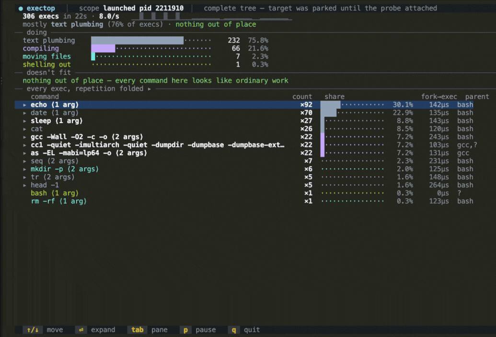
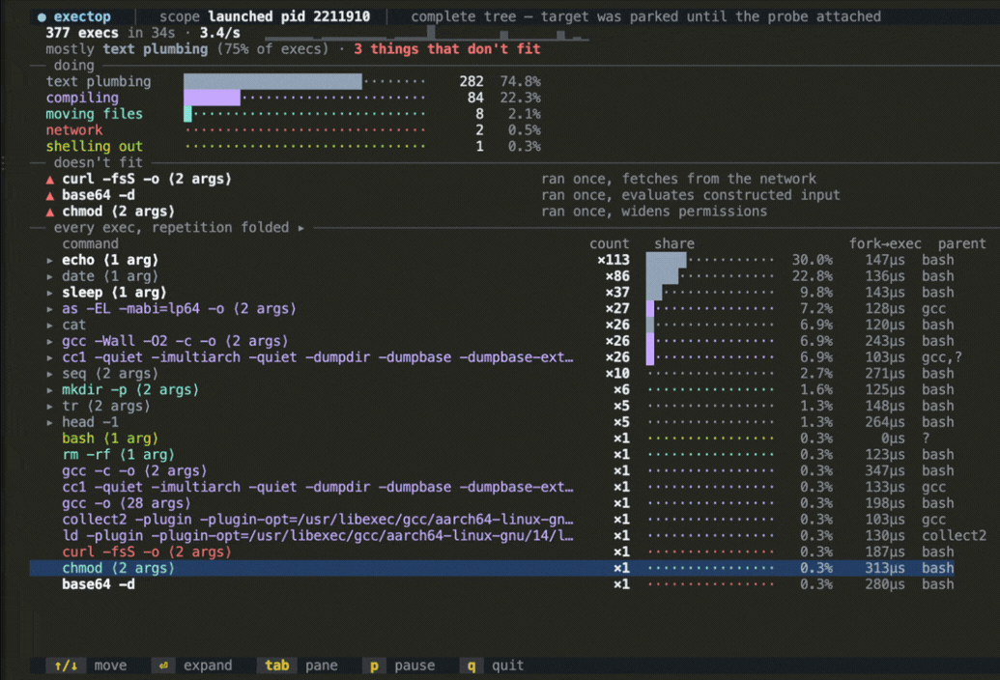

<!-- yeet:user-friendly-title: Watch what your app launches -->
# `exectop`

> **`top` for the programs your build launches.** Hundreds of execs fold into a handful of rows, with anything that looks odd ranked on top.

<p align="center">
  <a href="#requirements"></a>
  <a href="https://yeet.cx/docs/?utm_source=github&utm_medium=readme&utm_campaign=exectop&utm_content=badge"></a>
  <a href="#the-bpf-side"></a>
  <a href="#license"></a>
  <a href="https://discord.gg/JxVseaAVAU"></a>
</p>

<p align="center">
  
</p>

**`exectop` is a scoped process-launch monitor for Linux: it shows every program one application starts, folds the repetition into one row per kind, and ranks anything that doesn't look like ordinary work above the rest.**

## Quick start

```sh
curl -fsSL https://yeet.cx | sh          # install yeet, once
yeet run gh:yeet-src/exectop -- --pid $$   # watch this shell and everything it starts
```

The classic `execsnoop` from bcc prints every exec on the machine as a flat line-per-event stream. That is the right shape for `grep`, and the wrong shape for reading: a single `npm install` with native modules emits a few hundred lines, a busy host emits thousands, and none of it is scoped to the thing you actually care about.

This one asks a narrower question. You name one application, by launching it, by container, or by pid, and it follows that process tree through `fork` in the kernel. Then it collapses repetition, so a nine-file C build reads as three rows of `×9` rather than 27 lines of compiler invocation, and puts the handful of commands that don't fit the pattern on top.

> [!TIP]
> **Folding is what makes the unusual visible.** A loop that runs `echo`, `date` and `head` a few thousand times is 7,745 lines of exec log, or eight rows once repetition is grouped. At eight rows you can see the shape of what ran; at 7,745 lines a single unexpected `curl` is just one more line going past. The compression is not a convenience, it is the thing that makes an outlier legible as one.

## Contents

**Run it** — [Get started](#get-started) · [Choosing what to watch](#choosing-what-to-watch) · [Have an agent set it up](#have-an-agent-set-it-up) · [Reading it without a TTY](#reading-it-without-a-tty)
**Understand it** — [A 30-second primer on exec](#a-30-second-primer-on-exec) · [Questions this tool answers](#questions-this-tool-answers) · [What you're looking at](#what-youre-looking-at) · [Navigation](#navigation) · [How it works](#how-it-works)
**Reference** — [Requirements](#requirements) · [What it can't see](#what-it-cant-see) · [FAQ](#faq)
**Contribute** — [Building from source](#building-from-source) · [Testing across kernels](#testing-across-kernels) · [Try it without real traffic](#try-it-without-real-traffic)

## Get started

```sh
curl -fsSL https://yeet.cx | sh
make                        # clang + bpftool → bin/probe.bpf.o ; esbuild → the JS bundle
./bin/exectop -- npm ci   # run npm ci and watch every process it starts
```
[Manual install guide](https://yeet.cx/docs/manual-installation?utm_source=github&utm_medium=readme&utm_campaign=exectop) | Linux only

`bin/exectop` is a small wrapper around `yeet run`. It exists for one reason: launching a command under the probe requires spawning a process, and a yeet isolate deliberately cannot do that. The wrapper starts your command stopped, hands its pid to the script, waits for the probe to attach, then lets it go. Attach modes need no wrapper and take the plain runtime form, with flags after `--` so they reach the script rather than `yeet` itself:

```sh
yeet run . -- --container api      # everything a running container starts
yeet run . -- --pid 4242           # a process and its descendants
yeet run .                         # whole host, unscoped
```

It runs until you `Ctrl-C`, reflows on resize, and needs a real terminal. Don't pipe or redirect it; see [Reading it without a TTY](#reading-it-without-a-tty) for the text path.

## Choosing what to watch

Three modes, and the difference between them is what they can promise, not just what they cover.

| mode | invocation | what it covers |
| --- | --- | --- |
| Launch | `./bin/exectop -- <command>` | The command and every descendant, from its first instruction. Nothing is missed. |
| Container | `yeet run . -- --container <name>` | Everything the container's process tree starts, scoped by cgroup when one resolves. |
| Pid | `yeet run . -- --pid <pid>` | A running process and everything it starts **from now on**. |
| Host | `yeet run .` | Every exec on the machine. The bcc-shaped firehose, folded. |

Launch mode is the one to reach for when you have the choice. Because the target is held stopped until the probe is attached, there is no window in which it can fork unobserved, and the status bar says `complete tree` to mean exactly that. The attach modes carry an unavoidable gap: a process that forked its children before you attached is invisible until it forks again, and the status bar says `pre-existing children not tracked` rather than implying otherwise.

Container mode is the one you want during an incident. Attach to a container you suspect is doing something it shouldn't and you get one of two useful answers: a list of what it is launching, or silence, which tells you the problem is inside the application rather than in something it shells out to.

## Have an agent set it up

```
Set up exectop, a yeet script that shows every process an application launches.

1. git clone https://github.com/yeet-src/exectop && cd exectop
   (or: cd into an existing clone and `git pull`)
2. Read AGENTS.md for the runtime API and the gotcha list.
3. Run `make`. It fetches its own clang/bpftool/esbuild; no system toolchain needed.
4. Verify the probe works headlessly, before touching the TUI:
     yeet run src/probes/capture.js -- $$ 15
   Then, in another shell, run something that starts processes (`ls; git status; make`).
   You should see a report with a fold count and a bucket breakdown.
5. Run the real thing with a workload under it:
     ./bin/exectop -- bash -c 'for i in 1 2 3; do /bin/echo hi >/dev/null; done'
   Rows should appear and the count should climb.

Platform trap: this is Linux-only and needs a BTF-capable kernel. On macOS use a
Lima VM; `demo/live.sh` does the sync-and-build for you.

"It compiled" is not the same as "it works". Step 4 is the one that proves the
probe attached and events are arriving.
```

Prefer to drive it yourself? [Get started](#get-started) is the three-line version.

## A 30-second primer on exec

A process starts another program in two steps. `fork` makes a copy of the current process, and `exec` replaces that copy's memory with a new program. Almost everything you think of as "running a command" is a fork followed by an exec: your shell forks, the child execs `/bin/ls`, and the program you asked for is now running.

That split is why this tool hooks both. `sched_process_exec` is the event you want to see, because it carries the program and its arguments. But an exec alone doesn't tell you whose process it was, and "this application" means a tree, not a pid. So `sched_process_fork` propagates membership: when a process being watched forks, its child joins the set, in the kernel, before it has a chance to exec anything. `sched_process_exit` removes it again.

Two things follow from this, and both shape what the tool can tell you. The arguments come from the new program's own memory, so they are what the kernel was actually asked to run rather than what a script said it would run. And a long-running service that starts up and then serves traffic execs almost nothing: the interesting activity is concentrated in builds, installs, deploys and scripts.

## Questions this tool answers

**I'm about to add an npm package I don't fully trust. How do I see what its install scripts actually do?**
Run the install under it: `./bin/exectop -- npm install`. Every process the install starts appears, and anything unusual is ranked at the top with a reason. A postinstall that fetches from the network, decodes a blob, widens permissions, or reads `~/.ssh` shows up as a labelled row rather than as something you would have to find by reading the package's scripts.

**My build is slow and I can't tell what it's spending time on. How do I see what it's actually running?**
Watch it run. Repetition is folded, so a row reading `×2420` (a real count, from a loop calling `echo` in the demo workload) tells you at a glance what is happening thousands of times. The usual finding is something running per-file that should run once, or a step running twice. The `fork→exec` column gives the median time between a process being created and the program starting, which separates a slow program from a slow *launch*.

**Something's wrong with this container and the logs don't say what. How do I see if it's shelling out to something?**
`yeet run . -- --container <name>`. You get one of two answers, and both are useful: a list of what it launches, or silence. Silence is a real result, and the screen says so rather than sitting on a spinner: it means nothing in that container is starting processes, so the problem is inside the application.

**How do I check what a process is launching on a box where I can't install anything and there's no Docker?**
Install yeet once and `yeet run . -- --pid <pid>`. It's a terminal program over SSH; there's no agent to deploy, no sidecar, and nothing added to the process you're watching. Note the honest limit: attaching to something already running only sees what it starts from that point on. If you can launch the thing yourself, launch mode has no such gap.

**My CI job passes locally and fails in the pipeline. How do I see what the pipeline actually ran?**
Wrap the job's command in `./bin/exectop -- <command>` and compare the fold list between the two environments. Differences in what got launched, a different compiler, a fallback path taken, a tool that wasn't found, show up as rows that exist in one run and not the other.

**Can I hand developers something that checks a dependency before it gets merged, without setting up a security platform?**
Yes, within limits worth knowing. It's a single binary run and the output is readable in a terminal or as text, so it fits a pre-merge check on one machine. It ranks what looks unusual, and it is not a scanner or a policy engine: it has no rules to configure, no database of known-bad packages, and no way to block anything. Treat it as a look at what happened, not as a gate.

**Is this a replacement for Snyk, Socket.dev, or a supply-chain security scanner?**
No. Those analyze packages before you run them, keep a database of known-bad releases, and integrate with a pipeline to block a merge. `exectop` watches one run on one host, keeps nothing after you quit, and never blocks anything. It also only sees processes, so a package that does its damage inside Node without launching anything is invisible to it. What it gives you that a scanner doesn't is what *this* install did on *this* machine just now, including the parts nobody has catalogued yet. Use both.

**When should I use this instead of bcc's `execsnoop`, `strace`, or reading the install scripts?**
Reach for this one when the question is "what did this application launch", especially when the answer is hundreds of events and you need it grouped. Reach for bcc's `execsnoop` when you want a flat, greppable, host-wide line stream to pipe somewhere. Reach for `strace -f` when you need every syscall for one process rather than every process launch for one tree; it sees far more, at a much higher cost, and it is painful across a process tree. Reading the scripts is worth doing and answers a different question: what the author intended, rather than what ran. For CPU profiling of a single process rather than what it spawns, [`hotspot`](https://github.com/yeet-src/hotspot) is the sibling; it deliberately excludes forked children, which is exactly what this covers.

## What you're looking at

<p align="center">
  
</p>

```
 ● exectop   ▏  scope launched pid 2211910  ▏  complete tree — target was parked until the probe attached
  425 execs in 42s · 7.6/s   ▁▁▂▅█▄▂▁▁▃▆█▅▃▁▁▂▄▇█▆▃▁▁▂▅█▄▂▁▁▁▁▁▁
  mostly text plumbing (76% of execs) · 4 things that don't fit
── doing ────────────────────────────────────────────────────────────────────
  text plumbing    ███████████████████████·······    323  76.0%
  compiling        ██████························     84  19.8%
  moving files     ······························      8   1.9%
  other            ······························      7   1.6%
  network          ······························      2   0.5%
  shelling out     ······························      1   0.2%
── doesn't fit ──────────────────────────────────────────────────────────────
  ▲ curl -fsS -o ⟨2 args⟩              ran once, fetches from the network
  ▲ base64 -d                          ran once, evaluates constructed input
  ▲ ls ⟨1 arg⟩                         ran once, touches credential paths
  ▲ chmod ⟨2 args⟩                     ran once, widens permissions
── every exec, repetition folded ▸ ──────────────────────────────────────────
    command                              count   share          fork→exec  parent
  ▸ echo ⟨1 arg⟩                          ×124  ██······  29.2%     149µs  bash
  ▸ date ⟨1 arg⟩                           ×90  █·······  21.2%     137µs  bash
  ▸ sleep ⟨1 arg⟩                          ×46  █·······  10.8%     145µs  bash
  ▸ as -EL -mabi=lp64 -o ⟨2 args⟩          ×27  ········   6.4%     128µs  gcc
  ▸ gcc -Wall -O2 -c -o ⟨2 args⟩           ×26  ········   6.1%     243µs  bash
  ▸ cc1 -quiet -imultiarch -quiet …        ×26  ········   6.1%     103µs  gcc,?
```

The screen reads top to bottom, general to specific. The **status bar** names what you're scoped to and what that scope can promise. The **verdict** is two lines: totals with a rate sparkline, then the dominant kind of work and whether anything looks out of place. **doing** groups every exec into behavior buckets, which is the fastest way to see that a build is mostly compiling or mostly shell. **doesn't fit** ranks the unusual. **every exec, repetition folded** is the full picture, one row per kind of command.

| column | meaning |
| --- | --- |
| `▸` / `▾` | the row can be expanded to show individual commands; `▾` means it is |
| command | the program plus its flags, with positional paths elided as `⟨2 args⟩` |
| count | how many times this kind of command ran, `×1` when it ran once |
| share | that count as a proportion of every exec in the window |
| `fork→exec` | median time between the process being created and the program starting |
| parent | the program that started it, comma-separated when there was more than one |

Row color carries the behavior bucket, so compilers, shells and network commands are distinguishable without a badge column. A command that has just appeared flashes white and fades over about 700ms, which is what makes a process that lived three milliseconds visible at all.

### What gets flagged

The `doesn't fit` panel ranks rare commands that also did something a build step has no business doing. Rarity alone is not enough, and that boundary is the whole design: measured against a real `npm install`, 11 of 34 distinct commands ran exactly once, so "ran once" on its own would flag a third of an ordinary build.

A row appears only if it ran three times or fewer **and** matched one of: fetching from the network, piping a download into a shell, evaluating constructed input, widening permissions, changing privileges, touching credential paths, or unpacking into `/tmp`. Every reason names something observed in the arguments, never a guess about intent. A build that legitimately fetches six times stays silent, because six is that build's normal.

## Navigation

| key | action |
| --- | --- |
| `↑` `↓` or `k` `j` | move the cursor |
| `Enter` | expand a fold to its individual commands, or jump from a finding to its row |
| `Tab` | switch focus between the findings panel and the tree |
| `PgUp` `PgDn` | move ten rows |
| `g` | jump back to the top |
| `p` | pause the feed |
| `q` or `Esc` | quit |

Expanding a row shows the last six actual command lines behind that fold, with their pids, which is where the elided paths come back. Selecting a finding with `Enter` moves the cursor to that command in the tree and expands it, so the finding and its evidence are one keystroke apart.

## Reading it without a TTY

A TUI is unreadable to an agent, a CI job, or an SSH session in a hurry. The data layer runs standalone and prints a plain-text report:

```sh
yeet run src/probes/capture.js -- <root-pid> 30
```

It seeds the same traced set, aggregates for the given number of seconds, then prints the totals, the bucket breakdown, the findings and the top folds as text before exiting. That makes it the right thing for verifying the probe works (it is step 4 of [the agent prompt](#have-an-agent-set-it-up)), for a CI check, and for piping somewhere.

There is no `--json` mode. The `RingBuf.subscribe` callback in [`src/probes/exec.js`](src/probes/exec.js) sees every normalized record before aggregation, so a JSON or HTTP sink is a branch there rather than a rewrite.

## How it works

Three layers, dependencies pointing downward. `src/probes/` is the only BPF-aware code and exposes plain signals; `src/components/` is pure presentation and never sees BPF; `src/lib/` is pure helpers with no I/O, which is why the aggregation can be tested against recorded captures with no kernel involved.

```
src/bpf/exectop.bpf.c   three sched tracepoints; the traced set and the exec stream
src/probes/probe.js       loads bin/probe.bpf.o, binds the maps, starts the tracepoints
src/probes/exec.js        seeds the root, subscribes to the ring buffer, exposes signals
src/probes/capture.js     headless: aggregate for N seconds and print a text report
src/lib/argv.js           splits the raw argv blob; normalizes a record for the model
src/lib/model.js          folding, behavior buckets, the outlier scoring
src/lib/scope.js          resolves a container name or pid to a root, via the system graph
src/lib/format.js         palette, string helpers, bars and sparklines
src/components/*.jsx      verdict, buckets, findings, tree, chrome
bin/exectop             the launcher; owns launch mode's SIGSTOP handoff
```

### The BPF side

| program | hook | what it captures |
| --- | --- | --- |
| `on_exec` | `tracepoint/sched/sched_process_exec` | one record per exec: pid, ppid, comm, argv, depth, fork→exec time |
| `on_fork` | `tracepoint/sched/sched_process_fork` | adds the child to the traced set, one generation deeper |
| `on_exit` | `tracepoint/sched/sched_process_exit` | removes a task from the traced set |

Four maps. `events` is a 4 MiB `RINGBUF`, sized for the fact that exec storms are bursty rather than steady. `traced` is a `HASH` of tgid to depth: userspace seeds it with one root pid and the kernel grows it at every fork, which is what makes the scope a tree rather than a pid. `fork_ts` is a `HASH` holding a fork timestamp per pid so exec can report the gap. `scratch` is a `PERCPU_ARRAY` of one element, because an event carrying a 1 KiB argv buffer is far past the 512-byte BPF stack limit.

The in-kernel filter is one lookup in `traced` before anything is copied. An exec by a process outside the scope costs a hash lookup and a return, so the cost tracks the traced application rather than total activity on the host.

### Reading argv without fighting the verifier

The obvious way to capture arguments is to walk the userspace `argv` pointer array. The verifier hates it: a bounded loop over indexed userspace pointers, each read fallible, is the shape it is designed to reject, and bcc's version carries the complexity to prove it.

There is a simpler path. The kernel already stores the arguments contiguously at `mm->arg_start..arg_end` as a NUL-separated blob, so one bounded `bpf_probe_read_user` copies the lot and JavaScript splits it. No loop, no pointer chasing. The object compiles and passes the verifier with no complaints on 6.12 arm64.

<details>
<summary>Two envelope traps that cost real time</summary>

Both fail silently, which is what made them expensive.

**A `char[]` field arrives truncated at the first NUL.** For a NUL-separated argv blob that means you only ever see `argv[0]`, while the length field still reports the true byte count. Declaring the field `__u8[]` makes it arrive as a full byte array.

**A map declared with scalar `__type(key, __u32)` silently drops writes from userspace.** The update returns without error and the entry never lands, because the JS map API serializes through BTF and a scalar has no struct to name. Wrapping key and value in named structs (`struct traced_key { __u32 tgid; }`) fixes it. This one presented as a fork-propagation bug and sent the investigation in the wrong direction for a while.

</details>

### The JS side

| module | responsibility |
| --- | --- |
| `probes/exec.js` | one ring-buffer subscription, coalesced into a 100ms tick so a burst of hundreds doesn't cost a render each |
| `lib/argv.js` | splits the blob on NUL, marks truncation, normalizes to the record shape the model consumes |
| `lib/model.js` | the fold key, the behavior buckets, the outlier scoring, the rate history |
| `lib/scope.js` | resolves a container to its root pid and cgroup through the system graph |

The kernel stays dumb on purpose. It copies bytes and maintains a set; every decision about what counts as "the same command", what kind of work it is, and whether it is unusual happens in JavaScript, where it can be changed without a verifier round trip and tested against recorded captures.

The fold key is the interesting part. It is the command plus its flag names, with positional paths dropped and repeated flags deduplicated, so `cc1 -quiet a.c` and `cc1 -quiet b.c` fold together while `cc1 -O2` stays separate. Two carve-outs came from real data: subcommands count as part of the identity for tools that have them, so `git add` and `git gc` don't merge, and `sh -c` folds on the first command *inside* the script rather than the script text, because a generated Makefile emits a different script per target and folding on the text shatters one recipe into dozens of one-off rows.

### Why a tracepoint, not a syscall hook

Hooking `sys_enter_execve` is the obvious alternative and it is worse in two specific ways. It fires on the *attempt*, so a failed exec looks identical to a successful one, and its arguments are still userspace pointers in the calling process. `sched_process_exec` fires after the new program is installed, which means the exec succeeded and the arguments are readable from the new `mm`. It is also a stable tracepoint rather than a syscall ABI, so the same object works across architectures without a per-arch entry point.

## Building from source

```sh
make            # both compilers: BPF object + JS bundle
make veristat   # load every program through the verifier on this kernel
make clean
```

`make` runs two independent toolchains. clang and bpftool compile `src/bpf/exectop.bpf.c` into the loadable object `bin/probe.bpf.o`; esbuild bundles `src/main.jsx` into `src/index.jsx` with the `yeet:*` builtins left external. Both come from a checksum-pinned toolchain fetched into a per-machine cache, so the build needs no system clang and no Node or npm. `bin/probe.bpf.o`, `src/index.jsx` and `.build/` are generated.

The `@/` and `#/` aliases are bundle-time only, resolved by esbuild through the tsconfig `paths`. That is why the BPF object is located at runtime with `import.meta.dirname` rather than through an alias, and it surprises everyone once: a module run directly with `yeet run src/probes/foo.js` has to reach its siblings by relative path.

## Testing across kernels

A BPF program that loads on your laptop can be rejected by an older kernel's verifier, and that failure surfaces on a user's machine rather than yours.

`make veristat` loads every program through the verifier on your own kernel and reports per-program complexity. [`.github/workflows/kernel-matrix.yml`](.github/workflows/kernel-matrix.yml) builds the object and boots each kernel in its matrix in a VM, failing if any verifier rejects it. Run the same matrix locally on Linux with KVM using `make veristat-matrix`.

The aggregation has its own suite, which needs no kernel:

```sh
node test/heuristics.test.mjs
```

It runs the folding and the outlier scoring against five recorded captures in `test/` and asserts both halves of the claim: three benign builds produce no findings, and the adversarial ones produce the expected findings. The captures are real probe output rather than synthesized fixtures, deliberately: an earlier synthetic version of this suite passed while the heuristics were badly wrong.

## Try it without real traffic

```sh
demo/live.sh              # menu: build, sketchy, noisy, container, or watch a shell
demo/record.sh            # the 60-second showcase used for the GIF above
demo/run.sh               # replay recorded captures; needs only node, no Linux
```

`demo/live.sh` is the real tool on real kernel events. On macOS it syncs to a Lima VM, builds there, starts a workload and hands you the TUI. `demo/record.sh` runs the paced 60-second workload in `demo/showcase.sh` at 100×30 and is how the hero GIF is reproduced; `--cast` records an asciinema file. Everything the demos run is genuine work that stays inside `/tmp`, and the network fetches use `file://` URLs, so nothing leaves the machine.

`demo/run.sh` is the fallback for a machine with no VM. It replays the checked-in captures through the same aggregation, so the folding and the findings are real even though the events are recorded.

## Requirements

> [!IMPORTANT]
> - **A Linux kernel with BTF** (`CONFIG_DEBUG_INFO_BTF=y`) for CO-RE, which `bpftool` reads to generate `src/bpf/include/vmlinux.h`. Default on current Arch, Fedora, Ubuntu, and Debian. Verified on 6.1, 6.6, 6.12 and bpf-next; CO-RE means no per-kernel recompile.
> - **The `sched_process_exec`, `_fork` and `_exit` tracepoints**, which are long-standing and present on every kernel in that range.
> - **The yeet daemon**, which handles the privileged load. `yeet run` is not run with `sudo`.

Container mode additionally needs Docker reachable from the host running the probe, since the container's root pid is resolved through the system graph.

## What it can't see

> [!NOTE]
> `exectop` is observability, not enforcement. It tells you what was launched; it does not stop, delay, or modify anything. For a kernel-enforced boundary around what a process can touch, [`agent-lock`](https://github.com/yeet-src/agent-lock) is the sibling that blocks rather than reports.

- **Anything that doesn't exec.** A dependency that does its damage inside Node, Python, or the JVM without launching a program is invisible here. Fetching a URL with `fetch()` looks like nothing; fetching it with `curl` is a row. This is the boundary that matters most when reasoning about what the findings panel can and cannot catch.
- **Arguments past 1 KiB.** The kernel copies a fixed 1024-byte window of the argument blob and marks the record truncated. A very long compiler invocation is cut off; the program, its flags and the timing stay correct.
- **Children that already existed** when you attach with `--pid` or `--container`. Membership propagates at `fork`, so a process that forked before you attached is outside the set until it forks again. Launch mode has no such gap, which is the reason to prefer it.
- **Which files a process touched, or what it sent.** This is process launches only. For file access see [`agent-lock`](https://github.com/yeet-src/agent-lock), for HTTP see [`container-traffic`](https://github.com/yeet-src/container-traffic), for raw packets [`pktscope`](https://github.com/yeet-src/pktscope).
- **A determined adversary.** The findings are pattern matches on observed command lines. Anything that renames a binary, builds its argument string at runtime, or avoids launching a process at all will not be flagged. It is a way to see what happened, not a control that something can be prevented from evading.
- **Anything after you quit.** No retention, no aggregation across machines, no alerting. One host, one session.
- **`comm` is 16 bytes.** Long process names are truncated by the kernel, not by `exectop`.

## FAQ

**Why is the screen empty?**
Most likely nothing in your scope is launching processes, and that is a real answer rather than a failure. A service that has finished starting up and is serving traffic execs almost nothing. After a few seconds the verdict line says so explicitly, with how long it has been quiet. If you expected activity, check that you scoped to the right thing: `--pid` on a supervisor whose children predate the attach shows nothing until it forks again.

**Why does one command appear as several rows?**
Different flags mean different folds, by design, because `gcc -c` and `gcc -o` are different operations. Subcommands split too, so `git add` and `git commit` are separate rows. If a split looks wrong, expand the rows to see the actual command lines.

**Does watching a busy host slow it down?**
The in-kernel filter is a single hash lookup before any data is copied, so an exec outside your scope costs almost nothing and the work tracks the application you're watching rather than the host. Exec is also a comparatively rare event: a busy build is hundreds per second, where the network path this technique is usually applied to is tens of thousands.

**Can I run it in CI?**
Yes, through `yeet run src/probes/capture.js -- <pid> <seconds>`, which prints a text report and exits. The TUI itself needs a real terminal and will refuse to start without one.

**Why is `fork→exec` sometimes 0?**
The timestamp is recorded at `fork`, so a process that was already alive when its exec was captured has nothing to measure from. This shows up on the first process in an attach-mode scope and resolves for everything forked afterward.

## License

Apache-2.0.

---

Built with [yeet](https://yeet.cx/docs/?utm_source=github&utm_medium=readme&utm_campaign=exectop&utm_content=footer), a JS runtime for writing eBPF programs on Linux machines. Join us on [discord](https://discord.gg/JxVseaAVAU).
